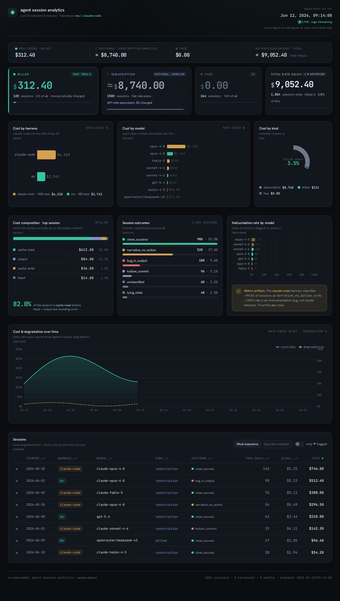

# mu-analytics

Cross-fleet agent-session analytics: **classify, measure, and cost** sessions from
two harnesses — the `mu` runtime and claude-code (cc) — in one place. Config-driven,
**installed tools only** (no `uv`/pip downloads, no new jails), the operator's
py-polars substrate. Built 2026-06-14.



> *Screenshot rendered with **synthetic demo data** (`MU_ANALYTICS_DEMO=1 ./run gen_dashboard.py`) —
> every figure shown is fabricated for illustration, not real usage.*

> **For the next agent:** read the "Hard-won knowledge" section before changing
> anything. Most of what looks arbitrary here was paid for — don't re-derive it.

---

## Run it

```sh
cd mu-analytics
cp config.example.toml config.toml   # first time only: then edit [paths] for your machine
./run cc_telemetry.py      # emit cc sessions -> mu-core TaskTelemetry events (all cc accounts, from config)
~/.local/bin/mu analytics compact --events-dir data/cc-events --db data/cc-telemetry.sqlite
./run cost.py              # cross-fleet cost over mu's sink + the cc sink (stdout report)
./run gen_dashboard.py     # build the live dashboard -> dist/ (self-contained, nginx-servable)
```

`./run <script.py> [args]` resolves the **canonical interpreter** from `config.toml`
via `tq` and execs it. The canonical interpreter is `/usr/local/bin/python3.11`
(the **pkg** python — it has polars and finds `lib/`). **Do NOT use
`~/.local/bin/python`** — it's a second python3.11 that is *pkg-blind* (its
`sys.path` lacks `/usr/local/lib/python3.11/site-packages`), so `import polars`
fails there. That shadowing is the classic "I installed it and it's not found" trap.

---

## Layout

| file | what |
|---|---|
| `config.example.toml` | tracked template — `cp` to `config.toml` and edit `[paths]`. Carries `[rates]`/`[cache_multipliers]`/`[cost_kind]` ready to use. |
| `config.toml` | your machine's copy (gitignored — holds absolute paths). Single source of truth at runtime; edit this, not code. |
| `run` | launcher — `tq -f config.toml -r python_interpreter_path` then exec |
| `cc_telemetry.py` | cc transcript → mu-core `TaskTelemetry` (+ `tool_call`) JSONL, per session |
| `cost.py` | read both sinks via stdlib `sqlite3`→polars, join `[rates]`, compute cost, split by `cost_kind`, hand-check |
| `sample_data.py` | `build()` assembles the dashboard `DATA` contract from the sink; `./run sample_data.py` prints it as JSON |
| `demo_data.py` | same contract shape, **fabricated** numbers — `MU_ANALYTICS_DEMO=1` uses it to render the screenshot above without exposing real usage |
| `gen_dashboard.py` | inject live `DATA` into `index.html` → self-contained `dist/`; cron-regenerable (honors `MU_ANALYTICS_DEMO`) |
| `index.html` + `assets/` | dashboard shell (vendored ECharts + fonts); placeholder data behind `/*BEGIN_DATA*/…/*END_DATA*/` markers |
| `dist/` | generated dashboard with **real** data — gitignored; point nginx here |
| `lib/mu_anthropic_py.*.so` | the typed Anthropic parser (built artifact — see "Rebuilding"); gitignored |
| `data/` | cc events + cc sink we own (mu's real sink is read-only, elsewhere); gitignored |

`tq` = shell bootstrap (the one value shell needs before python exists). Inside
python, `tomllib` (3.11 stdlib) reads the rest. No pip for either.

---

## Architecture / data flow

```
cc transcripts (~/.claude*/projects/*/*.jsonl, 3 accounts)
  └─ cc_telemetry.py ── typed parse (mu-anthropic) ──► mu-core TaskTelemetry JSONL ─┐
mu event logs (~/.local/share/mu/events/…, mu's own)                                │
  └─ mu's `mu analytics compact` (mu-042) ──► telemetry.sqlite (mu's sink) ◄────────┤
                                                                                    ▼
                              cost.py reads mu_sink_db (RO) + cc_sink_db, unions, prices
                              sample_data.build() ─► gen_dashboard.py ─► dist/index.html (ECharts, nginx)
```

The mu side is **already done** (spec mu-042, `crates/mu-coding/src/analytics/`):
it projects `TaskTelemetry` events → `~/.local/share/mu/telemetry.sqlite` (`tasks`
table) via `mu_core::forensics::classify_task`, queryable with `mu analytics
summary` / `rate`. We **reuse** that — cc just has to produce the right events.

---

## Hard-won knowledge (do not re-derive)

1. **The cc→mu gap is a single event type.** mu's projector (`compact.rs`) builds a
   `tasks` row *only* from a `TaskTelemetry` event. cc transcripts have none. The
   pre-existing converter (`mu/scripts/import-claude-history.py` + the `mu-bridge`
   crate) emits a **stale pre-mu-040 dialect** (no `session_id` envelope, an
   `audit_event` kind mu-core no longer has, no `TaskTelemetry`) — verified
   **11117/11117 lines malformed** under current mu-core. So `cc_telemetry.py`
   synthesizes a *current* `TaskTelemetry` per session directly and feeds the
   installed `mu analytics compact`. No mu rebuild, no mu-repo edits. The fuller
   "cc as a browsable mu session" converter (rebuild import-claude-history/mu-bridge
   on current mu-core) is a **deferred** follow-on.

2. **Typed parsing is the drift tripwire.** `cc_telemetry.py` parses each cc
   assistant message through `mu_anthropic_py` (typed pyo3 wheel over the
   `mu-anthropic` Rust crate). `is_valid_response_message()` returns False when the
   wire shape stops matching the typed model — i.e. **Anthropic changed the spec**,
   OR the message isn't Anthropic-shaped (the openrouter cc account). Those fall
   back to a hand-rolled read and are **counted** (last run: 95638 typed / 86
   fallback ≈ 99.9% typed). This is the same typed front door as the proxy/scheduled
   drift job — share it. The hand-rolled path is a fallback, not the primary.

3. **Rates are list pricing, pulled not guessed** (`[rates]`, USD/Mtok):
   - From the `claude-api` skill reference (cached 2026-06-04) for Anthropic;
     OpenRouter's **public** `/api/v1/models` for the rest (which *confirmed* the
     operator's prior `openai_codex` numbers).
   - **opus 4.x = 5/25** (an old script had 15/75 — that was the wrong one).
   - **Fable 5 = 10/50 = exactly 2× opus**, on both axes — "Fable is 2× opus" is
     *literal list pricing*, encoded as the real rate, **not** a cost multiplier.
   - Cache costs derive from each model's **input** rate via `[cache_multipliers]`
     (5m-write 1.25×, 1h-write 2.0×, read 0.10×). Unlisted models are **flagged**,
     never silently priced (`normalize_model`/`rate_key` strips provider prefixes &
     date suffixes, so `claude-haiku-4-5-20251001` hits `claude-haiku-4-5`).

4. **cost_kind is serving-path-determined, config-driven** (`[cost_kind]`):
   - `billed` = real per-token $ (anthropic_api, openrouter) · `subscription` =
     flat-rate, the figure is API-rate-*equivalent* not money paid (claude_code,
     openai_codex) · `free` = $0 (self-hosted/test/empty).
   - Free follows the **serving path, not the model**: `ollama/gemma` free,
     `openrouter/gemma` billed — same model. Provider decides; `[cost_kind.model]`
     overrides for oddballs (`faux` = mu's fake provider, runs under anthropic_api).
   - The emitter tags cc provider by account: `~/.claude-openrouter` → `openrouter`
     (billed), personal/work → `claude_code` (subscription).
   - **Headline:** in practice the **vast majority** of the notional total is
     `subscription` (flat-rate / OAuth — what that usage *would* cost at API rates),
     and only a **small fraction** is `billed` (real per-token money). Never present
     the total as a bill — the page renders the two side by side for exactly this
     reason. (Concrete figures live only in the generated `dist/`, never here.)

5. **Cache caveats.** mu's `tasks` sink stores **total** `cache_write_tokens` only —
   the 5m/1h split is dropped at projection. So cost uses the legacy **1.25× on
   total** (what mu's own SQL falls back to); tier accuracy needs the split computed
   upstream from events. OpenAI cache is a **subset** of input (not disjoint like
   Anthropic) so those cache costs are approximate. In practice **cache-READ
   dominates** session cost — on a long session it routinely dwarfs input, output,
   and cache-write combined.

6. **The logs are live.** This analytics reads `~/.claude*/projects` while sessions
   (including the one doing the analysis) are still being written — so "current"
   numbers **drift run-to-run on identical code**. Stamp results *as-of* a time;
   don't present a single final number.

7. **Dashboard = one DATA object.** `index.html` reads everything from a single
   `const DATA` between `/*BEGIN_DATA*/…/*END_DATA*/`; `gen_dashboard.py` swaps
   what's inside the markers with `sample_data.build()`. Change a *view* → edit the
   template's render JS; change the *data* → edit `sample_data.build()`. The
   committed `index.html` carries placeholder zeros (PII-free); real numbers live
   only in the gitignored `dist/`. The shell was designed in a Claude.ai artifact
   and un-bundled (its base64-inlined ECharts + fonts pulled out to `assets/`).

---

## Config reference (`config.toml`)

- `python_interpreter_path` — the pkg python3.11 (top-level scalar `tq` reads).
- `[paths]` — `mu_sink_db` (RO, mu's real sink), `cc_sink_db`, `cc_events_out`,
  `cc_log_roots` (all 3 cc accounts).
- `[rates]` — `"model" = { input, output }` USD/Mtok. `[cache_multipliers]`.
- `[cost_kind.provider]` / `[cost_kind.model]` — see knowledge #4.

---

## Rebuilding the typed parser wheel

The `lib/*.so` is a build artifact (FreeBSD / cp311 ABI). To rebuild:

```sh
cd ~/src/public_github/mu/crates/providers/mu-anthropic-py
maturin build --release --interpreter /usr/local/bin/python3.11   # ~30s
W=$(find ~/src/public_github/mu/target/wheels -name 'mu_anthropic_py*.whl' | head -1)
/usr/local/bin/python3.11 -c "import zipfile,sys;zipfile.ZipFile(sys.argv[1]).extractall('/tmp/maw')" "$W"
cp /tmp/maw/mu_anthropic_py*.so /path/to/mu-analytics/lib/
```

No system install / no pip — `cc_telemetry.py` adds `lib/` to `sys.path` itself.

---

## Deployment

Runs on the analytics host (default `10.1.1.172`) — there is **no manual copy
step**. A cron wrapper, `~/mu-stats/mu-analytics-refresh.sh`, fires every 15 min
and:

1. fast-forwards the shared checkout `~/src/public_github/mu-analytics` to
   `main@origin` **only when its working copy is clean** — a dirty dev tree is
   left untouched, never clobbered;
2. runs `refresh.sh` → `gen_dashboard.py` → `dist/`, served by nginx.

So **deploying = merging to `main`**: the next cron run picks it up within 15 min.
`just deploy` triggers the same wrapper immediately to skip the wait (override the
host with `MU_ANALYTICS_HOST`). If the host checkout is mid-edit (dirty), the
auto-sync is skipped — land the work or `jj new main@origin` there and it resumes.

Host runtime deps: `tq` (config reads, incl. `[anthropic].admin_key` for the cost
panel) and the canonical `python3` + `duckdb` (the `py` var in the justfile). Quick
cost-panel health check on the host: `python3 admin_usage.py` → `"ok": true`.

---

## Open / next

- **Display — DONE** (`gen_dashboard.py` → `dist/`). Dark ECharts dashboard:
  cost-by-kind / by-model, cache-read-dominates composition, outcomes,
  hallucination-by-model, cost+degradation trend, and a sortable, drill-down
  session table — `as_of`-stamped. Serve `dist/` via nginx;
  `@hourly /path/to/mu-analytics/run gen_dashboard.py` keeps it live.
  Caveats baked into the page: `degradation` + hallucination are **real but
  degenerate** (the commit-enricher gap classifies ~everything
  `narrative_no_action`; the dashboard says so); `flagged` is always false
  (operator marks aren't wired into the sink yet — the "operator-marked" table
  view is empty until they are).
- **Tier-accurate cache** — carry 5m/1h into the sink (mu-side Rust change) or
  compute cost from events; provider-branched formula for OpenAI subset semantics.
- **Full mu-session conversion** — emit complete current-mu-core sessions (not just
  TaskTelemetry) so cc is browsable in `mu console`; optionally rebuild the stale
  `import-claude-history.py` / `mu-bridge` on current mu-core, or retire them.
- **Price openrouter-gemma** if you want it off the unpriced list; decide
  ollama-vs-openrouter per the gemma model when both appear.

---

## Provenance

Built in one session 2026-06-14 (mu-analytics). The mu-side analytics it consumes
is spec **mu-042** (`crates/mu-coding/src/analytics/`, `crates/mu-core/src/forensics.rs`).
The typed parser is `crates/providers/mu-anthropic{,-py}`.
